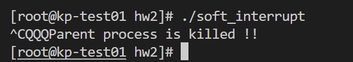
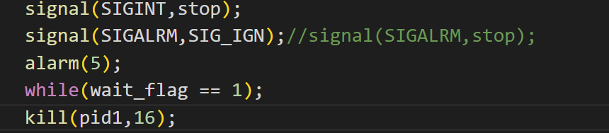

# 操作系统第二次实验
## 遇到的问题
1. 
    [解决方法](1)
2. 
    解决方法：在每个子进程里面都signal一个SIGINT。并且忽视信号。

## 实验结果
1.  - 问题：根据流程图编写程序，猜想一下这个程序的运行结果，然后多次运行，观察Delete/quit键前后，会出现什么结果？分析原因。
    - 结果如下：
    
    我们发现，一次是child 1 先被杀死，一次是child 2 先被杀死，这是因为两个子进程是异步执行的，不需要等待对方的结束。

2.  - 问题：如果程序运行界面上显示“Child process 1 is killed by parent !!  Child process 2 is killed by parent !!”，五秒之后显示“Parent process is killed !!”，怎样修改程序使得只有接收到相应的中断信号后再发生跳转，执行输出？
    - 如图修改代码，只有输入crtl+c才会发生跳转
    

3.  - 问题：将本实验中通信产生的中断通过14 号信号值进行闹钟中断，将signal(3,stop)当中数字信号变为2，体会不同中断的执行样式，从而对软中断机制有一个更好的理解。
    - 

[1]:https://blog.csdn.net/yockie/article/details/51729774?ops_request_misc=%257B%2522request%255Fid%2522%253A%2522166747707316782428683513%2522%252C%2522scm%2522%253A%252220140713.130102334..%2522%257D&request_id=166747707316782428683513&biz_id=0&utm_medium=distribute.pc_search_result.none-task-blog-2~all~top_positive~default-1-51729774-null-null.142^v62^pc_rank_34_queryrelevant25,201^v3^add_ask,213^v1^control&utm_term=signal&spm=1018.2226.3001.4187

