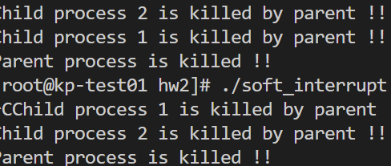

# 操作系统第二次实验
## 遇到的问题
1. 
    [解决方法](1)
2. 
    解决方法：在每个子进程里面都signal一个SIGINT。并且忽视信号。
3. 不会读写从管道里面读写数据
    [解决方法](2)

## 实验结果
### 进程的软中断
1.  - 问题：根据流程图编写程序，猜想一下这个程序的运行结果，然后多次运行，观察Delete/quit键前后，会出现什么结果？分析原因。
    - 结果如下：
    
    我们发现，一次是child 1 先被杀死，一次是child 2 先被杀死，这是因为两个子进程是异步执行的，不需要等待对方的结束。

2.  - 问题：如果程序运行界面上显示“Child process 1 is killed by parent !!  Child process 2 is killed by parent !!”，五秒之后显示“Parent process is killed !!”，怎样修改程序使得只有接收到相应的中断信号后再发生跳转，执行输出？
    - 如图修改代码，只有输入crtl+c才会发生跳转
    

3.  - 问题：将本实验中通信产生的中断通过14 号信号值进行闹钟中断，将signal(3,stop)当中数字信号变为2，体会不同中断的执行样式，从而对软中断机制有一个更好的理解。
    - 如图修改代码，通过不同的样式进行软中断。
    
    结果如下：
    

4. 实验问题：
    1. - Q:你最初认为运行结果会怎么样？写出你猜测的结果； 
        - A:^CChild process 1 is killed by parent !!
            Child process 2 is killed by parent !!
            Parent process is killed !! 
    2. - Q:实际的结果什么样？有什么特点？在接收不同中断前后有什么差别？请 将5秒内中断和5秒后中断的运行结果截图，试对产生该现象的原因进行分析。
        - A:实际结果可能会child 1 和 child 2 反过来。不同中断前后并无太大差别。五秒内中断会有输入^c而等待五秒自动中断则没有此项输入。
    3. - Q:针对实验过程2，怎样修改的程序？修改前后程序的运行结果是什么？请截图说明。
        - A：将sleep以及其后的wait_flag修改为0取消即可。
        
    4. - Q:针对实验过程3，程序运行的结果是什么样子？时钟中断有什么不同？
        - A:
        时钟中断是产生一个时钟信号，而不是仅仅等待五秒后执行程序。
    5. - Q:kill 命令在程序中使用了几次？每次的作用是什么？执行后的现象是什么？
        - A:使用了两次，分别给两个子进程传递信号。执行后子进程可以解除等待，然后输出Child process 1/2 is killed by parent !!
    6. - Q:使用kill 命令可以在进程的外部杀死进程。进程怎样能主动退出？这两种退出方式哪种更好一些？
        - A:调用exit即可主动退出。调用exit退出比较好。若是子进程kill父进程，则父进程没有办法使用wait函数处理子进程，子进程就会成为僵尸进程，僵尸进程多了之后，占用大量系统资源。

### 管道通信
1. 实验过程：
    1. - Q:先猜想一下这个程序的运行结果。分析管道通信是怎样实现同步与互斥的
        - A:隔五秒出现一个"Child 1/2 is sending message!",最后出现五千个1、2或者5000个2、1。管道通过wait()实现父子进程的同步，然后通过lockf实现子进程对于使用管道的互斥。
    2. - Q:然后按照注释里的要求把代码补充完整，运行程序
        - A:代码补全并进行适当修改见my_pipe.c    
    3. - Q:修改程序并运行，体会互斥锁的作用，比较有锁和无锁程序的运行结果，并解释之。
        - A:有锁的时候程序会输出1完后2或者2完后1，没锁的时候会1,2交替输出。

2. 实验报告中的问题：
    1.  - Q:你最初认为运行结果会怎么样？
        - A:屏幕上显示Child 1/2 is sending message!，过一会后屏幕上会出现一堆1/2.
    2.  - Q:实际的结果什么样？有什么特点？试对产生该现象的原因进行分析。
        - A:隔五秒出现一个"Child 1/2 is sending message!",最后出现五千个1、2或者5000个2、1。1和2完全是分开的。利用了互斥，那么子进程1进行管道write的时候子进程2是不能够操作的，反过来也一样。并且只有父进程wait完后才能进行read操作。
    3.  - Q:实验中管道通信是怎样实现同步与互斥的？如果不控制同步与互斥会发生什么后果？
        - A:管道通过wait()实现父子进程的同步，然后通过lockf实现子进程对于使用管道的互斥。有锁的时候程序会输出1完后2或者2完后1，没锁的时候会1,2交替输出。
    4.  - Q:把README和程序源代码附到实验报告后
        - A:在文件夹中
    

[1]:https://blog.csdn.net/yockie/article/details/51729774?ops_request_misc=%257B%2522request%255Fid%2522%253A%2522166747707316782428683513%2522%252C%2522scm%2522%253A%252220140713.130102334..%2522%257D&request_id=166747707316782428683513&biz_id=0&utm_medium=distribute.pc_search_result.none-task-blog-2~all~top_positive~default-1-51729774-null-null.142^v62^pc_rank_34_queryrelevant25,201^v3^add_ask,213^v1^control&utm_term=signal&spm=1018.2226.3001.4187

[2]:https://blog.csdn.net/skyroben/article/details/71513385?ops_request_misc=%257B%2522request%255Fid%2522%253A%2522166764531716800186560237%2522%252C%2522scm%2522%253A%252220140713.130102334..%2522%257D&request_id=166764531716800186560237&biz_id=0&utm_medium=distribute.pc_search_result.none-task-blog-2~all~top_positive~default-1-71513385-null-null.142^v63^pc_rank_34_queryrelevant25,201^v3^add_ask,213^v1^control&utm_term=pipe&spm=1018.2226.3001.4187