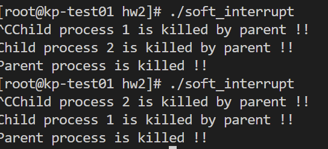
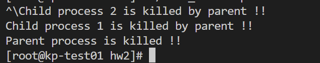
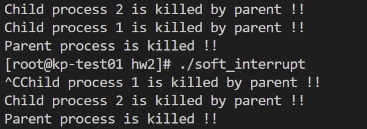
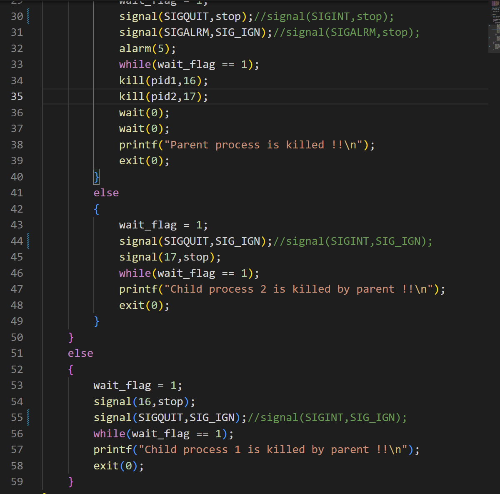

# 记录问题及解决过程    
1. 书上源程序报错wait函数

解决方法：引入#include <wait.h>  [解决问题的链接][1]
2. system隐式声明

解决方法：引入#include <stdlib.h>[解决问题的链接][4]
3. 无法引用pthread库

解决方法：手动编译一次 [解决问题的链接][2]
4. vscode不报错但是无法运行

解决方法：在终端自行手动编译 [解决问题的链接][3]
 
# 实验的具体步骤
## 任务一
- 多次运行程序并且观察结果

结果分析：
    + 进行三次运行，从每次的结果我们可以发现子进程里面的pid1与父进程的pid相同，这是因为父进程经过fork返回的是子进程的pid，而子进程getpid()后获得自己的pid，二者当然相同
    + 子进程经过fork后获得的pid是0
    + 父进程gitpid()获得自己的pid，与子进程的不同，并且父进程的pid比子进程的小4

- 去掉wait()后运行程序
    
    
    
    
    结果分析
    + 这三次parent先输出，原因是注释掉了wait()函数,父进程不用等子进程执行完毕再执行
    + 其余特性与未注释掉wait()函数时一致
    
- 设置全局变量并进行分析
    + 设置了全局变量int my_int = 1 ,在子进程里面对其进行加操作，父进程里面对其进行减操作，输出相应的值和地址。
    + 代码如下：
    
    + 运行结果如下：
    
    + 结果分析：
        + pid与pid1的分析结果与前边实验相同
        + 父子进程的my_int的地址都是相同的，这是因为子进程采用了虚拟内存技术，实际地址为基址+偏移量，子进程实际上只是把偏移量拷贝过来了放在了不同的基址中。而输出地址时输出的是变量位置在各自基址上的偏移量。
        + 父进程中my_int值为0，子进程中my_int值为2，原因是采用了写时复制技术，子进程在写时将虚拟空间中的堆栈等变成实际的物理空间，子进程的资源实际上是父进程的拷贝，二者实际对应不同的my_int。

- 在return前对全局变量进行更改并且输出结果
    + 更改的代码为
    
    + 运行的结果为
    
    + 结果解释：我们可以发现父进程与子进程输出的my_int的值是不一样的并且输出各自的pid1+my_int(此处的my_int是父子进程各自进行一定操作后的my_int)

- 利用system和exec函数调用外部函数
    + 更改后的代码以及外部函数的代码为：
    
    
    + 利用system函数调用外部函数程序运行的结果为
     
    + 利用exec函数调用外部函数程序运行的结果为
    
    + 结果分析：我们从运行结果里面可以发现，通过system调用外部函数后，进程的pid为child的pid1加一，而通过execl调用外部函数时进程的pid和child的pid1相等。这是因为，system中是一个fork和execl，相当于创建了一个子进程的子进程。而execl是直接将相应的外部函数加载到当前的地址上，覆盖(破坏)了当前进程的内容，但是进程的pid是不会变的。

## 任务二
- 在进程中给一变量赋初值并创建两个线程；在两个线程中分别对此变量循环五千次以上做不同的操作并输出结果
    + 结果如下(重复三次)：
    
    
    
    + 通过对结果的观察我们发现三次的结果是不相同的，说明两个线程是并发的并且同时修改传入的参数的值
    + 要解决两个线程的同步互斥问题，使得一个线程进入临界区的时候另外一个线程无法更改共享数据的值，我们就需要在共享数据区设置一个mutex个变量，在每个线程进入临界区之间进行P操作，从临界区出来后进行V操作，使得另外一个线程可以进入它的临界区执行操作，代码的具体实现如下：
    
- 将任务一中第一个实验调用system函数和调用exec族函数改成在线程中实现，观察运行结果输出进程PID与线程TID进行比较并说明原因
    + 调用system函数的结果如下
    
    + 调用execl函数的结果如下
    
    + 对结果的分析：我们发现新线程相当于拥有了一个新的pid，而原来的线程拥有的pid和进程的pid是一样的。并且两个线程的tid是不一样的。当通过system调用外部函数时，相当于又新开了个进程，pid有所改变，执行完外部函数后返回继续执行原来的程序。但当通过execl调用外部函数时，是将整个外部函数覆盖了目前的进程，所以进程后边的部分不在执行。

---
---

[1]: https://blog.csdn.net/wyhh_0101/article/details/83933308?ops_request_misc=%257B%2522request%255Fid%2522%253A%2522166633485316782390525276%2522%252C%2522scm%2522%253A%252220140713.130102334..%2522%257D&request_id=166633485316782390525276&biz_id=0&utm_medium=distribute.pc_search_result.none-task-blog-2~all~top_positive~default-1-83933308-null-null.142^v59^opensearch_v2,201^v3^add_ask&utm_term=wait&spm=1018.2226.3001.4187
[2]:https://blog.csdn.net/weixin_38102771/article/details/91351126?ops_request_misc=%257B%2522request%255Fid%2522%253A%2522166640731716800180649761%2522%252C%2522scm%2522%253A%252220140713.130102334..%2522%257D&request_id=166640731716800180649761&biz_id=0&utm_medium=distribute.pc_search_result.none-task-blog-2~all~baidu_landing_v2~default-2-91351126-null-null.142^v59^opensearch_v2,201^v3^add_ask&utm_term=pthread%E5%BA%93%E5%BC%95%E7%94%A8
[3]:https://blog.csdn.net/weixin_42676396/article/details/123993146?ops_request_misc=%257B%2522request%255Fid%2522%253A%2522166641102916800180699505%2522%252C%2522scm%2522%253A%252220140713.130102334..%2522%257D&request_id=166641102916800180699505&biz_id=0&utm_medium=distribute.pc_search_result.none-task-blog-2~all~top_positive~default-1-123993146-null-null.142^v59^opensearch_v2,201^v3^add_ask&utm_term=undefined%20reference%20to%20%60pthread_create&spm=1018.2226.3001.4187
[4]:https://blog.csdn.net/dark_cy/article/details/89715625?ops_request_misc=%257B%2522request%255Fid%2522%253A%2522166643347616800186522509%2522%252C%2522scm%2522%253A%252220140713.130102334..%2522%257D&request_id=166643347616800186522509&biz_id=0&utm_medium=distribute.pc_search_result.none-task-blog-2~all~sobaiduend~default-1-89715625-null-null.142^v59^opensearch_v2,201^v3^add_ask&utm_term=system%E5%87%BD%E6%95%B0%E5%A4%B4%E6%96%87%E4%BB%B6&spm=1018.2226.3001.4187