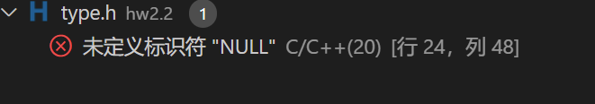
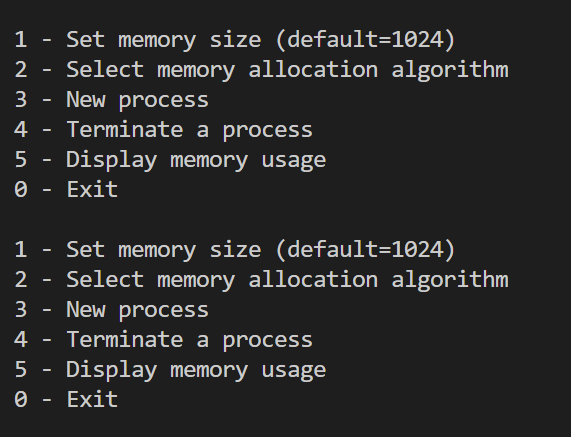

## 内存分配部分
### 遇到的问题
1. 
    
    解决方法： #define NULL 0
2. 

    - 每次输入执行一次操作以后都会弹出来两次菜单，通过将字符打印到屏幕我发现，有一个回车符也被认作是字符，导致多打印一次菜单。
    - 解决方法：当输入为0-5时不显示菜单。
3. - 出现segmentation fault 。
    - 解决方法：修改程序，保证指针不越界